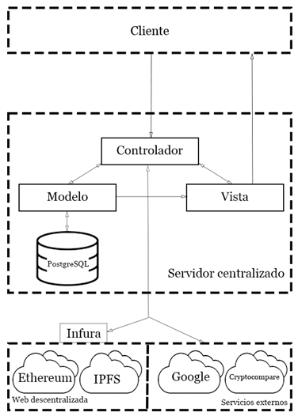

# DeustoCoin

> Jorge El Busto Suárez

> Proyecto Fin de Grado

---

# Introducción

DeustoCoin es una aplicación web realizada por Jorge El Busto para su Proyecto Fin de Grado de Ingeniería Informática. 

---

# Resumen

DeustoCoin es un proyecto que pretende fomentar el lema “Blockchain for Good” y contribuir a un mundo mejor a través de una tecnología emergente como es el Blockchain.

Dicho proyecto consta de una aplicación web en la que pueden operar tanto miembros de la universidad de Deusto como promotores de campañas pertenecientes a empresas externas a la universidad (cafeterías, museos, transporte...).

Mediante este proyecto, se pretende mejorar la imagen corporativa de la Universidad, cumpliendo con varios de los 17 ODS (Objetivos de Desarrollo Sostenible) establecidos por las Naciones Unidas.

Hay varios roles que conforman la plataforma de DeustoCoin, además de una criptomoneda basada en Ethereum (UDCoin) que será la moneda a canjear por las diferentes ofertas. Los roles en cuestión varían en función del usuario, y hay tres: alumno o participante en campaña, promotor, y un administrador que podrá realizar las tareas de los dos tipos de usuario anteriores.

Los participantes de las campañas podrán realizar una serie de tareas como el envío de monedas, consulta de campañas, canjeo de UDCoins en ofertas y registro y confirmación de una buena acción para así obtener su respectiva recompensa.

Los promotores podrán lanzar campañas y acciones, monitorizar las métricas de objetivos (KPIs) de las mismas, y observar en gráficas el progreso de las acciones correspondientes a las campañas.

Las tecnologías utilizadas en el proyecto son Python, Ethereum (Infura), IPFS, HTML y Google App Engine.

---

# Despliegue en la nube

La aplicación se encuentra desplegada en Heroku, y puede accederse a ella mediante haciendo clic en este enlace. 

[DeustoCoin](https://deustocoin.herokuapp.com)

---

# Arquitectura del sistema

---

# Diagrama entidad - relación

